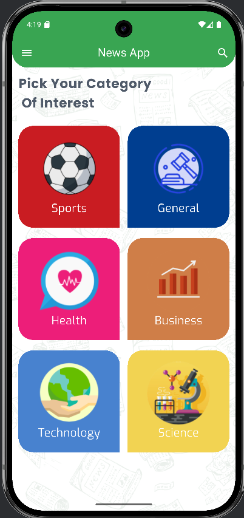
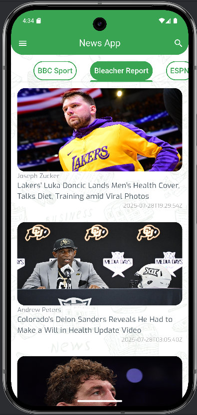
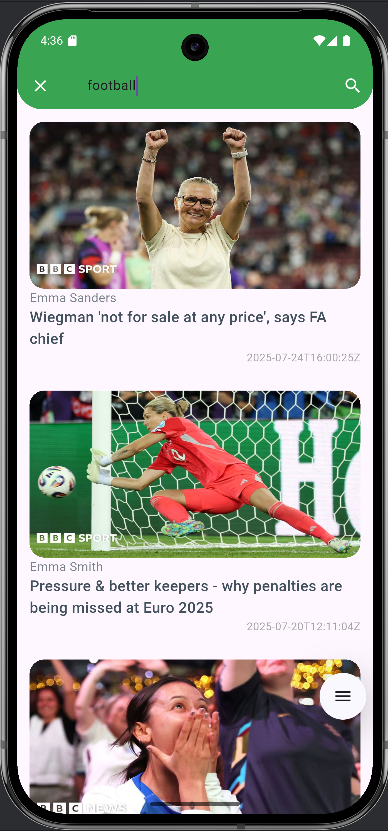
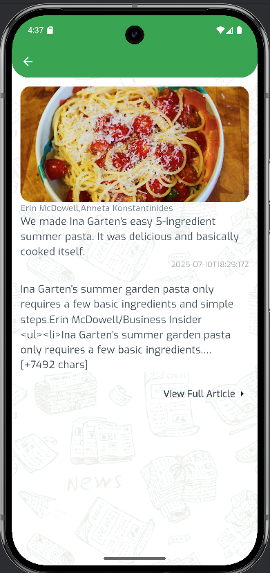

# news_app
Flutter app that provides users with real-time access to the latest news articles and
updates from various sources.

## Main packages used

- [http](https://pub.dev/packages/http) to make integration with Api
- [flutter_bloc](https://pub.dev/packages/bloc) as state management
- [injectable](https://pub.dev/packages/injectable) to make dependency injection

## Folder structure
I Have applied Repository Design Pattern

## App ScreenShots

Here are some screeshots for the application:

### 📽️ Demo Video

[▶️ Watch the video](### 📽️ Demo Video

[▶️ Watch the video](https://drive.google.com/file/d/1ihWg0knvlLfIihl6clGPXDBk7NcnGPmg/view?usp=drive_link)